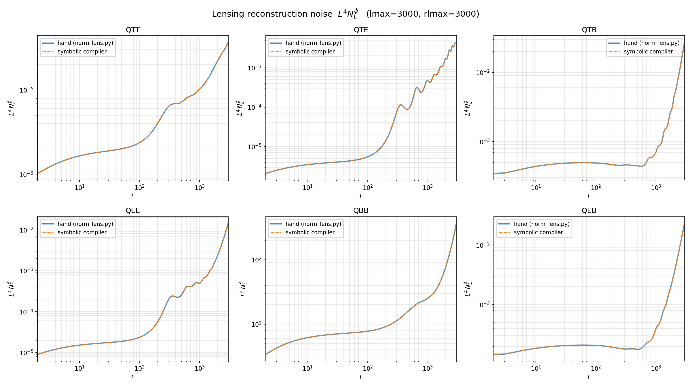
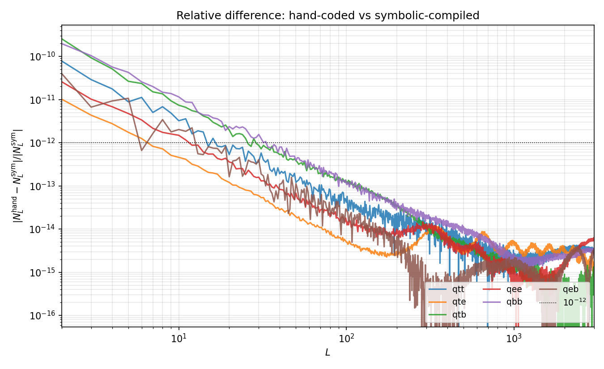

#+TITLE: Symbolic Lens
#+AUTHOR: Y. Guan
#+DESCRIPTION: Symbolic and numerical computation of CMB lensing normalization kernels
#+PROPERTY: header-args:python :session *symbolic-lens* :results output :exports both

* Overview

This project computes CMB (Cosmic Microwave Background) lensing reconstruction
normalization kernels. It combines:

1. A *symbolic algebra system* that manipulates Wigner 3j / Wigner-d expressions
   and compiles them into numerical functions.
2. A *numerical backend* using JAX-accelerated Gauss-Legendre quadrature and
   Wigner-d recurrence relations.

The goal is to go from a physics expression (products of Wigner 3j symbols summed
over two ells) to a compiled numerical kernel automatically.

* Quick start

The public surface lives at the top-level =symqe= package.  A typical
physicist session is one import and three lines:

#+begin_src python
import symqe as sq

g = sq.f_TT()   # or f_EE / f_EB / f_rot_EB / f_ampl_TT / ...
estimator = sq.build_estimator(g, lmax=LMAX, nside=NSIDE, X='T', Y='T')
phi_alm   = estimator(T_alm, T_alm, spectra)
#+end_src

For unified (estimator, normalization, reconstruction noise):

#+begin_src python
estimator, A_L_fn, N_L_phi_fn = sq.compile_qe_from_f(
    f_TT, lmax=LMAX, Delta=2, hCxx=sq.hCT, hCyy=sq.hCT,
    user_funcs=[sq.hCT, sq.CT], nside=NSIDE,
)
fom = sq.fisher_fom(N_L_phi_fn(obs_cltt, cltt), A_L_fn(obs_cltt, cltt),
                    L_range=range(40, 181), L_ref=80)
#+end_src

Ergonomically-named members (partial list): =f_TT=, =f_EE=, =f_EB=,
=f_rot_EB=, =f_ampl_TT= (weight builders); =build_estimator=,
=compile_estimator=, =compile_norm=, =compile_qe=, =compile_qe_from_f=,
=compile_native=, =compile_tt=, =compile_ee=, =compile_eb=, ...
(compilers); =fisher_fom= (gauge-fixed scoring); =Pixelization=,
=EstimatorTerm=, =NormCompiler= (types); =hCT=, =hCE=, =hCB=, =a=,
=gamma_f=, =q_plus=, =q_minus= (spectra and ladder helpers);
=l=, =l1=, =l2=, =P=, =wigner_3j= (DSL grammar).  See the following
sections for how each piece fits into the symbolic pipeline.

* Setup

The project is pip-installable:

#+begin_src shell :results output
pip install -e .                  # core
pip install -e .[dev,validation]  # + pytest + pytempura
#+end_src

On Compute Canada clusters (no pip in the base env), set =PYTHONPATH= instead:

#+begin_src shell :results output
module load python/3.11 scipy-stack/2025a
export PYTHONPATH=$PWD/src:$PYTHONPATH
#+end_src

Dependencies (declared in =pyproject.toml=): =numpy=, =scipy=, =sympy=,
=healpy=, =pixell=.  Validation extras: =pytempura=, =falafel=
(for bit-for-bit regression against the falafel QE pipeline).

* Project Structure

#+begin_example
symbolic_lens/
├── pyproject.toml          # pip install -e .
├── README.org              # this file
│
├── src/symqe/              # library core (the installable package)
│   ├── engine/             # symbolic compiler (5-layer atomic-tree engine)
│   │   ├── atom.py             # Layer 1: AtomicFactor tree (domain-agnostic)
│   │   ├── sympy_bridge.py     # Layer 2: sympy → atom conversion
│   │   ├── normal_form.py      # Layer 3: flatten to sum-of-products
│   │   ├── quotient.py         # Layer 4: reduce mod polynomial relations (P²=1)
│   │   ├── l12_sum.py          # Layer 5a: kernel normalization (W² → GL quad)
│   │   ├── estimator.py        # Layer 5b: estimator compiler (W → SHT recipe)
│   │   ├── estimator_backend.py# falafel-delegating emitter (backend A)
│   │   ├── estimator_native.py # native SHT emitter + generic compile_native
│   │   ├── compile_qe.py       # unified compile: estimator + A_L + N_L^phi
│   │   └── namikawa.py         # shared W^{x,0/±} and f^{XY} definitions
│   └── reference/          # hand-coded reference implementations
│       ├── norm_lens.py        # lensing normalization kernels (pytempura-validated)
│       ├── glquad.py           # GL-quadrature wrapper
│       ├── fastgl.py           # FastGL nodes (Bogaert algorithm)
│       ├── wignerd.py          # Wigner-d via JAX 3-term recurrence
│       └── utils.py            # CMB theory spectra helper
│
├── tests/                  # pytest regressions vs falafel / pytempura
├── scripts/
│   ├── demos/              # demo_rotation_estimator, demo_search_*
│   └── analysis/           # check_full_norm, comp_sym_vs_hand, comp_tempura,
│                           # probe_int_trunc[_error_summary], probe_qe_shear_final
├── archive/probes/         # one-shot debug scripts from prior investigations
├── extras/wignerd_comparison.jl
└── figures/                # generated plots
#+end_example

* Numerical Layer

** Fast Gauss-Legendre Quadrature (=src/symqe/reference/fastgl.py=)

Computes GL quadrature nodes and weights using the Bogaert algorithm, which
evaluates Bessel zeros and Chebyshev interpolants to achieve high accuracy for
arbitrary =n=. Validated against =numpy.polynomial.legendre.leggauss=.

#+begin_src python
from symqe.reference.fastgl import FastGL
import numpy as np

gl = FastGL(101)
x_ref, w_ref = np.polynomial.legendre.leggauss(101)
print("nodes match:", np.allclose(gl.x, x_ref, rtol=1e-8))
print("weights match:", np.allclose(gl.w, w_ref, rtol=1e-8))
#+end_src

** Wigner-d Transforms (=src/symqe/reference/wignerd.py=)

Implements forward and inverse Wigner-d transforms using a three-term recurrence
relation, JIT-compiled with JAX for performance.

- =cf_from_cl(s1, s2, cl, cos_theta, lmax)=: harmonic coefficients $C_\ell$ to
  configuration-space function $f(\theta)$
- =cl_from_cf(s1, s2, cf, cos_theta, weights, lmax)=: inverse transform

#+begin_src python
from symqe.reference.wignerd import cf_from_cl, cl_from_cf
import numpy as np

s1, s2 = 1, 2
lmax = 10
cl = np.arange(lmax + 1) * 1.0
cos_theta = np.linspace(-1, 1, 10)

cf = cf_from_cl(s1, s2, cl, cos_theta, lmax)
print("cf:", np.array(cf))
#+end_src

** GLQuad Wrapper (=src/symqe/reference/glquad.py=)

Combines =FastGL= and Wigner-d transforms into a convenient interface. This is
the main numerical workhorse used by both the hand-coded kernels and the symbolic
compiler.

#+begin_src python
from symqe.reference.glquad import GLQuad
import numpy as np

glq = GLQuad(15)
cl = np.arange(1, 12, dtype=float)
cf = glq.cf_from_cl(1, 2, cl)
print("cf:", np.array(cf))

cl_recon = glq.cl_from_cf(3, 4, cf, 10)
print("cl_recon:", np.array(cl_recon))
#+end_src

* Symbolic Engine

The symbolic engine automates the derivation of lensing kernels. Instead of
hand-coding each kernel (as in =src/symqe/reference/norm_lens.py=), we write the physics expression
symbolically and let the compiler produce a numerical function.

The engine is organized as five layers, lowest being the most general. The
first four are domain-agnostic and reusable for any symbolic pipeline; the
fifth is CMB-lensing-specific.

** Layer 1: Atomic-factor tree (=src/symqe/engine/atom.py=)

An =AtomicFactor= is a pure immutable tree:
=Const=, =Var=, =Pow=, =Mul=, =Add=, =FuncApp(name, args)=. Constructors
=const=, =var=, =power=, =mul=, =add=, =func= preserve atomicity — they
flatten nested =Mul=/=Add= and fold numeric constants, but never
auto-distribute. ~Mul(Add(a,b), c)~ stays that way until you explicitly
call =distribute()=. This is the invariant that makes downstream pattern
matching predictable, and is what sympy's eager rewriting does not give
you.

Utilities: =free_vars=, =evaluate(env)=, =structural_key= (hashable identity
for grouping), =substitute=, =walk= (bottom-up rewrite), =distribute=
(explicit), =partition_factors= (bucket factors by predicates).

** Layer 2: SymPy bridge (=src/symqe/engine/sympy_bridge.py=)

=from_sympy(expr)= converts a sympy expression to an =AtomicFactor= tree.
This is the *only* place in the pipeline that calls sympy. Symbol →
=Var=; Integer/Rational/pi/… → =Const=; =Pow/Mul/Add= → constructors;
any sympy =Function= instance (including user =Function= subclasses and
the project's =wigner_3j= class) → =FuncApp(class_name, args)=. No
domain knowledge is baked in — e.g., the bridge does not know what
=wigner_3j= means.

** Layer 3: Normal form (=src/symqe/engine/normal_form.py=)

=flatten(atom)= → =list[FlatTerm(coeff, factors)]=, the sum-of-products
canonical form. This is the atomic-tree analogue of sympy's =.expand()=
followed by =.as_ordered_terms()=, but entirely under our control (no
surprise rewrites anywhere else in the tree).

** Layer 4: Quotient reduction (=src/symqe/engine/quotient.py=)

=reduce_mod_power(terms, var_name, period, residues)= collapses
~var^period = residues.get(0, 1)~. For P² = 1 one passes =period=2= and
the default residues; the reducer rewrites each ~P^(2k) → 1~,
~P^(2k+1) → P~. Works for any idempotent or nilpotent variable (e.g.,
Grassmann ~ε² = 0~ by passing =residues={0: Const(1), 2: Const(0)}=).

** Layer 5: L12 Sum Compiler (=src/symqe/engine/l12_sum.py=)

Compiles symbolic expressions of the form:

$$\sum_{\ell_1, \ell_2} (\text{Wigner 3j products}) \times A(\ell_1) \times B(\ell_2)$$

into numerical functions that use Gauss-Legendre quadrature.

The compilation pipeline:

1. =from_sympy= converts the expression to the atomic tree.
2. =_normalize_w3j_args= permutes each =wigner_3j= FuncApp's j-args to
   the canonical ordering $(\ell, \ell_1, \ell_2)$ via the 3j
   column-permutation identity, introducing a $P$ factor for odd
   permutations.
3. =flatten= distributes and expands integer powers.
4. =reduce_mod_power= collapses $P^k$ modulo $P^2 = 1$.
5. Each =FlatTerm= becomes a structured =Term= with slots
   ~(coeff, l_factor, l1_factor, l2_factor, wigd_l, wigd_l1, wigd_l2)~;
   the two w3j factors resolve to the wigd triple (3j-product →
   Wigner-d identity), any residual $P$ absorbs into a single leg's
   m-side flip, and each wigd $(m, n)$ is canonicalized to
   $m \ge 0$ (and $n \ge 0$ when $m = 0$), with sign flips accumulated
   into the coefficient.
6. Terms are grouped by =(wigd_l, l_factor.structural_key())= and emitted
   as a numpy closure that calls =cl2cf= / =cf2cl= on the GL quadrature
   backend.

Example usage:

#+begin_src python
from sympy import Function, sqrt, pi
from symqe.engine.l12_sum import (
    NormCompiler, wigner_3j, l, l1, l2, P
)

A, B = Function("A"), Function("B")

# Wigner 3j squared summed over l1, l2
expr = wigner_3j(l, l1, l2, 2, -2, 0)**2 * \
       ((2*l1 + 1)/(2*pi) * (2*l2 + 1) / (2*pi)) * \
       (1 + P) * B(l2) * A(l1)

compiler = NormCompiler(lmax=10, rlmin=1, rlmax=10)
f, terms = compiler.build_and_compile(expr, args=[l, A, B])
# f is a numpy callable kernel(ell_out, A_array, B_array)
#+end_src

** Estimator Compiler (=src/symqe/engine/estimator.py=)

The estimator side compiles the quadratic-estimator weight
$g^{XY}_{\ell L \ell'}$ (single Wigner 3j per term, unlike the
$W^2$-style normalization) into a list of =EstimatorTerm= objects, each
describing the real-space SHT recipe for one atomic contribution:

#+begin_example
 alm2map_spin(X * X_filter(l),   spin_transform = spin_X)
 alm2map_spin(Y * Y_filter(l'),  spin_transform = spin_Y)
 product in pixel space
 map2alm_spin(product,           spin_transform = spin_L)
 multiply output by L_factor(L)
#+end_example

The pipeline is identical to the kernel-side pipeline through layers 2-4
(sympy → atom tree → canonicalize w3j args → flatten → reduce $P^2 = 1$).
Layer 5 differs: instead of pairing two Wigner 3j's to form a Wigner-d
triple (a /GL-quadrature/ kernel), each flat term has exactly one 3j
whose m-values are extracted directly as signed SHT spins.

=src/symqe/engine/namikawa.py= provides the shared symbolic building blocks:
weights $W^{x,0}$, $W^{x,+}$, $W^{x,-}$ in l-first 3j form, and =f_XY=
builders for each of the 6 estimators (TT, TE, TB, EE, EB, BB). The
imaginary unit on $\zeta^- = i$ (for TB/EB estimators) is carried
through the coefficient.

*γ-normalization convention (read carefully).* Each filter ends up
containing $\sqrt{2\,\mathrm{var}+1}$ factors inherited from
$\gamma_{\ell_1 L \ell_2} = \sqrt{(2\ell_1+1)(2L+1)(2\ell_2+1)/(4\pi)}$.
The emitter /must not/ multiply these into the alm — standard
=pixell=/=healpy= normalization reproduces $\gamma$ implicitly via the
SHT identity

$$\int d\Omega\; {}_s Y^*_{LM}\; {}_{s_1} Y_{\ell_1 m_1}\; {}_{s_2} Y_{\ell_2 m_2}
  = \gamma_{\ell_1 L \ell_2}\, \begin{pmatrix}\ell_1 & \ell_2 & L\\ m_1 & m_2 & M\end{pmatrix}
  \begin{pmatrix}\ell_1 & \ell_2 & L\\ -s_1 & -s_2 & s\end{pmatrix}$$

so composing =alm2map_spin + alm2map_spin + (pixel multiply) + map2alm_spin=
reproduces $\gamma$ for free. Residual $1/\sqrt{4\pi}$ pieces sit in the
output coefficient; they are absorbed into the estimator's external
$1/(2L+1)$ normalization (Namikawa Eq. 82).

*Example usage (analyzer only; no SHTs executed):*

#+begin_src python
from sympy import sympify
from symqe.engine.l12_sum import l1, l2
from symqe.engine.namikawa import hCT, f_TT
from symqe.engine.estimator import compile_estimator, pretty_grouped

g_TT = f_TT(px=+1) / (sympify(2) * hCT(l1) * hCT(l2))
terms = compile_estimator(g_TT)
print(pretty_grouped(terms, x_name="T", y_name="T"))
# prints 4 atomic recipes matching falafel.qe.qe_temperature_only's structure
#+end_src

=tests/test_estimator_all.py= dumps the derived SHT plans for all 6 lensing
estimators; the per-leg =(filter, spin_transform)= structures match
=falafel.qe='s hand-coded implementations (=gradient_spin=,
=qe_spin_temperature_deflection=, =qe_spin_pol_deflection=).

* Lensing Normalization Kernels

** Basis Kernels (=src/symqe/reference/norm_lens.py=)

All estimator normalizations are built from 8 basis kernels corresponding to
$\Sigma$ and $\Gamma$ operations with spin-0 and spin-2 fields:

| Kernel     | Function           | Description                    |
|------------+--------------------+--------------------------------|
| $\Sigma^0$ | =kernel_S0=        | Spin-0 × spin-0 (temperature)  |
| $\Sigma^+$ | =kernel_Spm(p=1)=  | Spin-2 × spin-2 (same parity)  |
| $\Sigma^-$ | =kernel_Spm(p=-1)= | Spin-2 × spin-2 (cross parity) |
| $\Sigma^x$ | =kernel_Sx=        | Spin-0 × spin-2 (cross)        |
| $\Gamma^0$ | =kernel_G0=        | Gamma, spin-0 × spin-0         |
| $\Gamma^+$ | =kernel_Gpm(p=1)=  | Gamma, spin-2 same parity      |
| $\Gamma^-$ | =kernel_Gpm(p=-1)= | Gamma, spin-2 cross parity     |
| $\Gamma^x$ | =kernel_Gx=        | Gamma, spin-0 × spin-2         |

These are combined to form the standard quadratic estimator normalizations:

| Estimator | Function | Kernels used                      |
|-----------+----------+-----------------------------------|
| TT        | =qtt=    | $\Sigma^0 + \Gamma^0$             |
| TE        | =qte=    | $\Sigma^0 + 2\Gamma^x + \Sigma^+$ |
| TB        | =qtb=    | $\Sigma^-$                        |
| EE        | =qee=    | $\Sigma^+ + \Gamma^+$             |
| BB        | =qbb=    | $\Sigma^+ + \Gamma^+$             |
| EB        | =qeb=    | $\Sigma^- + 2\Gamma^- + \Sigma^-$ |

** Hand-coded vs Symbolic

The kernels in =src/symqe/reference/norm_lens.py= are hand-derived and manually translated to code.
The symbolic engine (=tests/test_norm_sym.py=) aims to reproduce these automatically
from the physics definitions.

* Testing the Symbolic Compiler

=tests/test_norm_sym.py= defines the lensing weight functions symbolically and compiles
all 8 basis kernels through the symbolic pipeline.

#+begin_src python
from sympy import Function, sqrt, pi, I
from symqe.engine.l12_sum import (
    NormCompiler, wigner_3j, l, l1, l2, P
)

A, B = Function("A"), Function("B")
zeta_p, zeta_m = 1, I
c_phi, p_phi = 1, 1

def gamma(l1, l2, l3):
    return sqrt((2*l1 + 1) * (2*l2 + 1) * (2*l3 + 1) / (4*pi))

def q_plus(c): return c * (1 + P) / 2
def a(ell, s): return -sqrt((ell - s) * (ell + s + 1) / 2)
def a_plus(ell): return a(ell, 2)
def a_minus(ell): return a(ell, -2)

def W_lens_0(l1, l_out, l2, c):
    return -2 * a(l1, 0) * a(l2, 0) * q_plus(c) * gamma(l1, l_out, l2) * \
           wigner_3j(l_out, l1, l2, 0, -1, 1)

def W_lens_p(l1, l_out, l2, c):
    term1 = a_plus(l2) * wigner_3j(l_out, l1, l2, -2, -1, 3)
    term2 = a_minus(l2) * wigner_3j(l_out, l1, l2, -2, 1, 1)
    return -zeta_p * q_plus(c) * gamma(l1, l_out, l2) * a(l1, 0) * (term1 + term2)

def build_sigma(W1, W2, l_out, c1, c2):
    expr = (1/(2*l_out + 1)) * W1(l1, l_out, l2, c1) * W2(l1, l_out, l2, c2)
    return expr * A(l1) * B(l2)

def build_gamma(W1, W2, l_out, c1, c2):
    expr = (1/(2*l_out + 1)) * W1(l1, l_out, l2, c1) * W2(l2, l_out, l1, c2)
    return expr * A(l1) * B(l2)

# Build all 8 basis kernels symbolically
kernels_lens = {}
sigma_p_expr = build_sigma(W_lens_p, W_lens_p, l, c_phi, c_phi)
gamma_p_expr = build_gamma(W_lens_p, W_lens_p, l, c_phi, c_phi)

kernels_lens["S0"] = build_sigma(W_lens_0, W_lens_0, l, c_phi, c_phi)
kernels_lens["Sp"] = sigma_p_expr
kernels_lens["Sm"] = sigma_p_expr.subs(P, -P)
kernels_lens["Sx"] = build_sigma(W_lens_0, W_lens_p, l, c_phi, c_phi)
kernels_lens["G0"] = build_gamma(W_lens_0, W_lens_0, l, c_phi, c_phi)
kernels_lens["Gp"] = gamma_p_expr
kernels_lens["Gm"] = gamma_p_expr.subs(P, -P)
kernels_lens["Gx"] = build_gamma(W_lens_0, W_lens_p, l, c_phi, c_phi)

# Compile
compiler = NormCompiler(lmax=100, rlmin=1, rlmax=100)
kernels_lens_func = {}
for name, expr in kernels_lens.items():
    print(f"Building {name}...")
    func, ir = compiler.build_and_compile(expr, args=[l, A, B])
    kernels_lens_func[name] = func
print("Compilation complete.")
#+end_src

Evaluate with test inputs:

#+begin_src python
import numpy as np

ell = np.arange(101)
A_test = ell**2
B_test = ell**2
for name, f in kernels_lens_func.items():
    result = f(ell, A_test, B_test)
    print(f"{name}: min={result.min():.3e}, max={result.max():.3e}")
#+end_src

* Running the Test Suite

With the package installed (=pip install -e .[dev]=):

#+begin_src shell :results output
pytest tests/
#+end_src

Or run a specific regression directly:

#+begin_src shell :results output
python tests/test_norm_sym.py
#+end_src

* Validation Against pytempura

=scripts/analysis/comp_tempura.py= compares the hand-coded kernels against the established
=pytempura= library for TT, TE, EE, and BB normalizations up to $\ell_\mathrm{max} = 4000$.

#+begin_src shell :results output
python scripts/analysis/comp_tempura.py
#+end_src

* Quadratic Estimator Theory

Reference: Toshiya Namikawa, "Computing quadratic estimator, delensing in
curvedsky" ([[https://toshiyan.github.io/clpdoc/doc/Computing__Curved_sky_code.pdf][PDF]]).

** Notation

- $\Theta$: CMB temperature; $Q, U$: Stokes parameters; $E, B$: polarization modes
- $\phi$: lensing potential; $\varpi$: curl mode
- $\ell, m$: multipoles of CMB anisotropies (small letters)
- $L, M$: multipoles of distortion fields (large letters)
- Multipole factor: $\gamma_{\ell_1 \ell_2 \ell_3} = \sqrt{(2\ell_1+1)(2\ell_2+1)(2\ell_3+1)/(4\pi)}$
- Parity indicator: $p_{\ell_1 \ell_2 \ell_3} = (-1)^{\ell_1+\ell_2+\ell_3}$
- Parity-weighted coefficients: $q^{x,\pm}_{\ell_1 \ell_2 \ell_3} = c_x \frac{1 \pm c_x^2 (-1)^{\ell_1+\ell_2+\ell_3}}{2}$
  where $c_\phi = 1$, $c_\varpi = -\mathrm{i}$
- Spin raising/lowering: $a^\pm_\ell = a^{\pm 2}_\ell = -\sqrt{(\ell \mp 2)(\ell \pm 3)/2}$,
  $a^0_\ell = -\sqrt{\ell(\ell+1)/2}$
- $\zeta^+ = 1$, $\zeta^- = \mathrm{i}$

** Lensing distortion and weight functions

Lensing remaps CMB anisotropies as $X(\hat{n}) = X[\hat{n} + \boldsymbol{d}(\hat{n})]$, where the
deflection field $\boldsymbol{d} = \nabla\phi + (\star\nabla)\varpi$. To first order, the
distorted harmonic coefficients pick up off-diagonal correlations characterized by
weight functions $W$.

For temperature (spin-0), the lensing weight function is (Eq. 38):

$$W^{x,0}_{\ell_1 \ell_2 \ell_3} = -2 a^0_{\ell_2} a^0_{\ell_3} q^{x,+}_{\ell_1 \ell_2 \ell_3} \gamma_{\ell_1 \ell_2 \ell_3} \begin{pmatrix} \ell_1 & \ell_2 & \ell_3 \\ 0 & 1 & -1 \end{pmatrix}$$

For polarization (spin-$\pm 2$), it is (Eq. 62):

$$W^{x,\pm}_{\ell_1 \ell_2 \ell_3} = -\zeta^\pm q^{x,\pm}_{\ell_1 \ell_2 \ell_3} \gamma_{\ell_1 \ell_2 \ell_3} a^0_{\ell_3} \left[ a^+_{\ell_2} \begin{pmatrix} \ell_1 & \ell_2 & \ell_3 \\ 2 & 1 & -3 \end{pmatrix} + c_x^2 a^-_{\ell_2} \begin{pmatrix} \ell_1 & \ell_2 & \ell_3 \\ 2 & -1 & -1 \end{pmatrix} \right]$$

The distorted E/B modes are (Eqs. 59, 60, 71-73):

$$\delta E_{\ell m} = \sum^{(\ell m)}_{LM\ell' m'} x_{LM} (E_{\ell' m'} W^{x,+}_{\ell L \ell'} + B_{\ell' m'} W^{x,-}_{\ell L \ell'})$$

$$\delta B_{\ell m} = \sum^{(\ell m)}_{LM\ell' m'} x_{LM} (-E_{\ell' m'} W^{x,-}_{\ell L \ell'} + B_{\ell' m'} W^{x,+}_{\ell L \ell'})$$

** Quadratic estimator

The general QE for distortion field $x$ from observed fields $\hat{X}, \hat{Y}$ is
(Eq. 80):

$$[\hat{x}^{XY}_{LM}]^* = A^{x,(XY)}_L \sum_{\ell\ell'mm'} \begin{pmatrix} \ell & \ell' & L \\ m & m' & M \end{pmatrix} g^{x,(XY)}_{\ell L \ell'} \hat{X}_{\ell m} \hat{Y}_{\ell' m'}$$

where $g$ is the estimator weight (Eq. 81):

$$g^{x,(XY)}_{\ell L \ell'} = \frac{[f^{x,(XY)}_{\ell L \ell'}]^*}{\Delta^{XY} \hat{C}^{XX}_\ell \hat{C}^{YY}_{\ell'}}$$

and $A_L$ is the normalization (Eq. 82):

$$[A^{x,(XY)}_L]^{-1} = \frac{1}{2L+1} \sum_{\ell\ell'} f^{x,(XY)}_{\ell L \ell'} g^{x,(XY)}_{\ell L \ell'}$$

$\Delta^{XX} = 2$, $\Delta^{EB} = \Delta^{TB} = 1$.

** Weight functions $f$ for each estimator (Sec. 3.5)

The weight functions that enter the normalization are (Eqs. 128-138):

| Estimator     | $f^{x}_{\ell L \ell'}$                                                                        |
|---------------+------------------------------------------------------------------------------------------------|
| $\Theta\Theta$ | $W^{x,0}_{\ell L \ell'} C^{\Theta\Theta}_{\ell'} + p_x W^{x,0}_{\ell' L \ell} C^{\Theta\Theta}_\ell$ |
| $\Theta E$    | $W^{x,0}_{\ell L \ell'} C^{\Theta E}_{\ell'} + p_x W^{x,+}_{\ell' L \ell} C^{\Theta E}_\ell$ |
| $\Theta B$    | $p_x W^{x,-}_{\ell' L \ell} C^{\Theta E}_\ell$                                                |
| $EE$          | $W^{x,+}_{\ell L \ell'} C^{EE}_{\ell'} + p_x W^{x,+}_{\ell' L \ell} C^{EE}_\ell$             |
| $EB$          | $W^{x,-}_{\ell L \ell'} C^{BB}_{\ell'} + p_x W^{x,-}_{\ell' L \ell} C^{EE}_\ell$             |
| $BB$          | $W^{x,+}_{\ell L \ell'} C^{BB}_{\ell'} + p_x W^{x,+}_{\ell' L \ell} C^{BB}_\ell$             |

where $p_x = p_{\ell L \ell'}$ for even parity fields ($x = \phi, \epsilon$) and
$p_x = -p_{\ell L \ell'}$ for odd parity ($x = \varpi, \alpha$).

** Normalization via kernel functions (Sec. 5 & 6)

The normalization $A_L^{-1}$ can be decomposed into $\Sigma$ and $\Gamma$ kernels
(Eqs. 227-230):

$$\Sigma^{(s),xy}_L[A,B] = \frac{1}{2L+1} \sum_{\ell\ell'} (W^{x,s}_{\ell L \ell'})^* W^{y,s}_{\ell L \ell'} A_\ell B_{\ell'}$$

$$\Gamma^{(s),xy}_L[A,B] = \frac{1}{2L+1} \sum_{\ell\ell'} (W^{x,s}_{\ell L \ell'})^* W^{y,s}_{\ell' L \ell} A_\ell B_{\ell'}$$

$$\Sigma^{(\times),xy}_L[A,B] = \frac{1}{2L+1} \sum_{\ell\ell'} W^{x,0}_{\ell L \ell'} W^{y,+}_{\ell L \ell'} A_\ell B_{\ell'}$$

$$\Gamma^{(\times),xy}_L[A,B] = \frac{1}{2L+1} \sum_{\ell\ell'} W^{x,0}_{\ell L \ell'} W^{y,+}_{\ell' L \ell} A_\ell B_{\ell'}$$

with $s = 0, \pm$. These are the 8 basis kernels implemented in =src/symqe/reference/norm_lens.py=.
Key symmetries: $\Sigma^{(s),xy}[A,B] = \Sigma^{(s),yx}[B,A]$ and
$\Gamma^{(s),xy}[A,B] = \Gamma^{(s),yx}[B,A]$.

** Explicit kernel functions in Wigner-d form (Sec. 6.1)

The kernel functions are converted from Wigner 3j sums to integrals over
Wigner-d products using the identity (Eq. 271):

$$\int_{-1}^{1} d\mu\; d^{\ell_1}_{s_1,s'_1}(\beta) d^{\ell_2}_{s_2,s'_2}(\beta) d^{\ell_3}_{s_3,s'_3}(\beta) = 2 \begin{pmatrix} \ell_1 & \ell_2 & \ell_3 \\ s_1 & s_2 & s_3 \end{pmatrix} \begin{pmatrix} \ell_1 & \ell_2 & \ell_3 \\ s'_1 & s'_2 & s'_3 \end{pmatrix}$$

with $s_1 + s_2 + s_3 = s'_1 + s'_2 + s'_3 = 0$. Defining
$\xi^A_{mm'} = \sum_\ell \frac{2\ell+1}{4\pi} A_\ell d^\ell_{mm'}$ (Eq. 276), the
lensing kernels become integrals of products of $\xi$ functions, e.g. (Eq. 278):

$$\Sigma^{(0),x}_L[A,B] = \int_{-1}^{1} d\mu\; \pi L(L+1) \{\xi^A_{00} \xi^{B\cdot\ell'(\ell'+1)/2}_{11} d^L_{1,-1} + c_x^2 \xi^A_{00} \xi^{B\cdot\ell'(\ell'+1)/2}_{1,-1} d^L_{1,1} \}$$

These integrals are evaluated numerically via Gauss-Legendre quadrature — this is
what =GLQuad.cf_from_cl= and =GLQuad.cl_from_cf= implement.

** Computing the unnormalized estimator (Sec. 4.3)

The key computational step is forming the deflection field $v^\alpha(\hat{n})$ in
real space as a product of filtered maps, then transforming back to harmonic
space. For each estimator (Eqs. 158-165, 173-180):

| Estimator       | $v^\alpha(\hat{n})$ (real-space product)                                                          |
|-----------------+---------------------------------------------------------------------------------------------------|
| $\Theta\Theta$  | $\bar\Theta (\Theta^+ + \mathrm{i}\Theta^-)$                                                     |
| $\Theta E$      | $\frac{1}{2}[\bar{Q}^E(\Theta^+_1 - \Theta^+_3) + \bar{U}^E(\Theta^-_1 - \Theta^-_3) + \ldots]$ |
| $\Theta B$      | $\frac{1}{2}[\bar{Q}^B(\Theta^-_1 - \Theta^-_3) + \bar{U}^B(\Theta^+_1 + \Theta^+_3) + \ldots]$ |
| $EE$            | $\frac{1}{2}[\bar{Q}^E(\mathcal{E}^+_1 - \mathcal{E}^+_3) + \bar{U}^E(\mathcal{E}^-_1 - \mathcal{E}^-_3) + \ldots]$ |
| $BB$            | Same as $EE$ with $\mathcal{E} \to \mathcal{B}$                                                   |
| $EB$            | $EE$-type + $BB$-type cross terms                                                                  |

where the spin fields $\Theta^\pm_{1,3}$, $\mathcal{E}^\pm_{1,3}$,
$\mathcal{B}^\pm_{1,3}$ are filtered CMB maps transformed via spin-weighted
spherical harmonics (Eqs. 169-171, 191):

\begin{align}
\Theta^+_1 + \mathrm{i}\Theta^-_1 &= -\sum_{\ell m} \bar\Theta_{\ell m} C^{\Theta E}_\ell \sqrt{\ell(\ell+1)} Y^1_{\ell m} \\
\mathcal{E}^+_1 + \mathrm{i}\mathcal{E}^-_1 &= -\sum_{\ell m} \bar{E}_{\ell m} C^{EE}_\ell \sqrt{(\ell+2)(\ell-1)} Y^1_{\ell m}
\end{align}

The unnormalized estimator is then obtained by (Eq. 167):

$$\bar\phi^{(\alpha)}_{\ell m} = -\frac{\sqrt{\ell(\ell+1)}}{2} \int d^2\hat{n}\; [(Y^1_{\ell m})^* v^\alpha - (Y^{-1}_{\ell m})^* (v^\alpha)^*]$$

which corresponds to =map2alm_spin= with spin=1 followed by multiplication by
$\sqrt{\ell(\ell+1)}$.

** Reference implementation: falafel

The [[https://github.com/simonsobs/falafel][falafel]] library (=/home/yguan/software/falafel=) implements the above
estimator computation. Key functions in =falafel/qe.py=:

- =gradient_spin(px, alm, mlmax, spin)=: applies $\sqrt{\ell(\ell+1)}$ in
  harmonic space, then =alm2map_spin= to get the gradient in real space
- =qe_spin_temperature_deflection=: $v^{\Theta\Theta} = -\nabla\bar{X} \cdot \bar{Y}$
- =qe_spin_pol_deflection=: polarization deflection via spin-$\pm 2$ fields
- =deflection_map_to_phi_curl_alms=: =map2alm_spin= then multiply by
  $\sqrt{\ell(\ell+1)}$
- =qe_all=: computes all estimators (TT, TE, TB, EE, EB, BB, mv, mvpol)

The pipeline:
1. Inverse-variance filter input alms: $\bar{X}_{\ell m} = \hat{X}_{\ell m} / \hat{C}^{XX}_\ell$
2. Form response-weighted alms: $\bar{X} C^{XY}_\ell$
3. Compute spin fields via =alm2map_spin= (real space)
4. Multiply in real space to get deflection $v(\hat{n})$
5. =map2alm_spin= back to harmonic space
6. Multiply by $\sqrt{\ell(\ell+1)}$ for $\phi$ (or curl)
7. Apply normalization $A_L$ (from =src/symqe/reference/norm_lens.py= or =pytempura=)

Falafel returns *unnormalized* estimates; normalization must be applied separately.

* Architecture

#+begin_example
 Symbolic physics expression
   (Wigner 3j products × Cl's × parity factor P)
         │
         ▼
 ┌───────────────────────────────┐
 │  engine/sympy_bridge.py       │  Layer 2: sympy → atom tree
 │  from_sympy                   │
 └──────────────┬────────────────┘
                │  AtomicFactor tree (engine/atom.py, Layer 1)
                ▼
 ┌───────────────────────────────┐
 │  engine/l12_sum.py            │  Layer 5: Wigner-specific rewrites
 │  _normalize_w3j_args          │    (w3j column permutation → P factor)
 └──────────────┬────────────────┘
                │
                ▼
 ┌───────────────────────────────┐
 │  engine/normal_form.py        │  Layer 3: flatten to sum-of-products
 │  flatten                      │    (explicit distribute; no sympy)
 └──────────────┬────────────────┘
                │  list[FlatTerm]
                ▼
 ┌───────────────────────────────┐
 │  engine/quotient.py           │  Layer 4: reduce P^k mod (P²-1)
 │  reduce_mod_power             │
 └──────────────┬────────────────┘
                │  P-reduced FlatTerms
                ▼
 ┌───────────────────────────────┐
 │  engine/l12_sum.py            │  Layer 5: FlatTerm → Term,
 │  _flat_term_to_term,          │    w3j pair → wigd triple,
 │  group + emit                 │    absorb P, canonicalize wigd,
 └──────────────┬────────────────┘    group by (wigd_l, l_factor),
                │                    emit numpy closure
                ▼
 ┌───────────────────────────────┐
 │  reference/glquad.py          │  Gauss-Legendre quadrature
 │  ├── reference/fastgl.py      │    (Bogaert algorithm for nodes)
 │  └── reference/wignerd.py     │    JAX JIT Wigner-d recurrence
 └──────────────┬────────────────┘
                │
                ▼
    Numerical output: A_L normalization arrays
                │
                ▼
 ┌───────────────────────────────┐
 │  Estimator (falafel)          │  Unnormalized QE via real-space
 │  qe.py                        │    multiplication + spin SHT
 └──────────────┬────────────────┘
                │  × A_L
                ▼
    Normalized lensing reconstruction φ_LM
#+end_example

* Validation

Two complementary checks confirm the symbolic engine is correct.

** Per-triangle sanity: symbolic vs brute-force 3j summation

=scripts/analysis/comp_sym_vs_hand.py= computes each of the 8 basis kernels
$\Sigma^0, \Sigma^\pm, \Sigma^\times, \Gamma^0, \Gamma^\pm, \Gamma^\times$
by two independent routes:

1. The symbolic compiler pipeline (=src/symqe/engine/l12_sum.py=).
2. A direct double-sum $\sum_{\ell_1, \ell_2}$ using
   =sympy.physics.wigner.wigner_3j= — exact rational 3j arithmetic.

This runs at small $\ell_{\max} = 10$ because the exact sympy 3j evaluator
is slow (scales like $\ell_{\max}^3$). It's a text-only pass/fail check:
every kernel must match to $\lesssim 10^{-9}$ relative. This pins down the
compiler at the atomic level before any recipe composition.

** End-to-end: reconstruction noise vs pytempura-validated reference

=scripts/analysis/check_full_norm.py= is the substantive check. It runs at realistic
$\ell_{\max} = 3000, \mathrm{rlmax} = 3000$ on the CMB lensed spectrum from
=cosmo2017_10K_acc3_lensedCls.dat= (the same file used by the Symlens.jl
=demo3_tempura.ipynb= comparison), with a dummy noise model
$N_\ell^{TT} = 10 (1 + \ell/1000)^3\,\mu\mathrm{K}^2$ and
$N_\ell^{\rm pol} = \sqrt{2}\, N_\ell^{TT}$.

The 8 symbolic kernels are combined via the Namikawa recipe into the six
quadratic-estimator normalizations and compared against the hand-coded
=src/symqe/reference/norm_lens.py= (which itself has been validated against =pytempura= at
$\text{rtol} \sim 10^{-9}$ — see =scripts/analysis/comp_tempura.py=).

Reconstruction-noise curves $L^4 N_L^{\phi}$ for each estimator (hand-coded
solid, symbolic-compiled dashed — they overplot indistinguishably):

#+begin_center

#+end_center

Relative difference between the two implementations across $L \in [2, 3000]$:

#+begin_center

#+end_center

Max $|N_L^{\text{hand}} - N_L^{\text{sym}}| / |N_L^{\text{sym}}|$ over
$L \in [10, 3000]$:

| Estimator | Max relative difference |
|-----------+--------------------------|
| qtt       | $3.6 \times 10^{-12}$    |
| qte       | $4.6 \times 10^{-13}$    |
| qtb       | $7.4 \times 10^{-12}$    |
| qee       | $1.5 \times 10^{-12}$    |
| qbb       | $1.2 \times 10^{-11}$    |
| qeb       | $2.2 \times 10^{-12}$    |

Agreement is at the floating-point accumulation limit of the GL quadrature
(~$10^{-12}$ over 3000 $L$-modes). The per-triangle check plus the
end-to-end agreement at realistic scales together demonstrate the symbolic
compiler is correct at both the component and composite level.

* Milestones

The estimator-compiler side of the project has progressed through five
milestones, all validated bit-for-bit against =falafel= and
=pytempura= (with one documented EB semantic difference, and one
deliberate reproduction of an upstream falafel int-truncation bug).
Each section below records the validation state, the rules / abstractions
added, and the diagnostics scripts.

** Milestone 1 — TT bit-for-bit match ✅

Complete. =src/symqe/engine/estimator_backend.py= implements

- =strip_gamma(terms)= — removes $\sqrt{2\ell_1+1}$, $\sqrt{2\ell_2+1}$,
  $\sqrt{2L+1}$ factors from =X_filter=, =Y_filter=, =L_factor=
  respectively. These come from γ and are reproduced implicitly by
  pixell/healpy SHT normalization.
- =compile_tt(terms, lmax, nside)= — identifies the X-gradient pair in a
  γ-stripped TT recipe, extracts the ell-space filters from the symbolic
  =EstimatorTerm=, and hands them to =falafel.qe.qe_temperature_only=
  (which has the signed-spin conventions already validated).
- A normalization-bookkeeping =pair_coeff= accounts for (a) the X↔Y
  swap symmetry (factor 2), (b) falafel's built-in $-\mathrm{grad}\cdot Y$
  sign, (c) falafel returning the $f$-pipeline output rather than $g$
  (factor Δ = 2), and (d) our residual $1/\sqrt{4\pi}$ γ-prefactor
  (factor $\sqrt{4\pi}$).

=tests/test_estimator_tt_vs_falafel.py= runs both paths on the same synthetic
$T_{\ell m}$ and confirms bit-for-bit agreement:

#+begin_example
Symbolic / falafel ratio statistics:
  median:  1.000000e+00
  mean:    1.000000e+00
  std:     1.449034e-15         # machine precision
  std/mean:                     # ratio is constant to ~10⁻¹⁵
    1.449e-15
#+end_example

** Milestone 2 — polarization ✅

Status: all 6 estimators validated bit-for-bit against =falafel.qe=.

| Estimator | Falafel primitive used               | Status |
|-----------+---------------------------------------+--------|
| TT        | ~qe_temperature_only~                 | ✅ 1e-15 |
| EE        | ~qe_pol_only~ (X_E, 0, Y_E, 0)        | ✅ 1e-15 |
| BB        | ~qe_pol_only~ (0, X_B, 0, Y_B)        | ✅ 1e-15 |
| TB        | ~qe_pol_only~ (X_E*, 0, 0, Y_B)       | ✅ 1e-15 |
| EB        | ~qe_pol_only~ (X_E, 0, 0, Y_B)        | ✅ 1e-15 (with $C_B = 0$ response) |
| TE        | ~qe_temperature_only~ + ~qe_pol_only~ | ✅ 1e-15 |

(*) For TB, the "X_E" slot receives $T \cdot C^{TE}/\hat C^{TT}$ —
a T alm pushed into falafel's E-slot via the TE response, matching
falafel's ~xalm('e_t0')~ convention.

The common recipe across all five validated cases:
1. =strip_gamma= removes the $\sqrt{2\ell+1}$ factors from the filters.
2. The emitter identifies the X-gradient pair in the symbolic recipe
   and reads off the response / IV filters.
3. Falafel's primitive is called with those filters applied to the
   input alms.
4. A ``pair_coeff`` bookkeeps Δ, γ residual, ±1 signs, ζ⁻ imaginary
   unit (TB/EB), and ×2 factors from symmetry or from undoing
   falafel's internal ``/2`` in ~qe_spin_pol_deflection~.

The C_B = 0 assumption for EB matches falafel's hardcoded
~pest(xalm('e0'), zero, zero, fBalm)~ convention — the primordial
B-mode term is dropped both in falafel and when we pass
``CB = np.zeros(...)`` to our symbolic evaluator.

TE combines the TT-style call and the pol call: f^{TE} has one W⁰ term
(temperature gradient on E, T plain → ~qe_temperature_only~) and one
W⁺ term (T-through-CTE gradient, E plain → ~qe_pol_only~).  Our
=compile_te= runs both halves and sums the alms, with independent
bookkeeping coefficients for each half.

** Milestone 3 — native SHT backend ✅

=src/symqe/engine/estimator_native.py= implements the same pipeline without a
=falafel= runtime dependency.  The SHT bookkeeping (=rot2d=, =irot2d=,
=Pixelization=, =gradient_spin=, =deflection_map_to_phi_curl_alms=,
=qe_temperature_only=, =qe_pol_only=) is inlined, using =pixell= and
=healpy= directly.  TT/EE/BB validated bit-for-bit against backend A:

#+begin_example
  TT      median=1.000000e+00   std/mean=4.1e-17  MATCH
  EE      median=1.000000e+00   std/mean=4.1e-17  MATCH
  BB      median=1.000000e+00   std/mean=4.2e-17  MATCH
#+end_example

*Latent falafel bug flagged during validation.*
=falafel.qe.gradient_spin= initializes its per-ell filter as
``fl = ells * 0``, which is an integer array because =ells= comes from
=np.arange= without an explicit dtype.  Subsequent in-place float
assignments (=sqrt((ells-1)*(ells+2))=, =sqrt((ells-2)*(ells+3))=) are
silently truncated to integers, so the spin-±2 gradient filters are
only accurate to the nearest integer.  Our native backend reproduces
this exactly for regression fidelity; a one-line upstream fix
(``fl = np.zeros_like(ells, dtype=float)``) would restore full precision
on both backends simultaneously.

*What milestone 3 unlocks.*  The native backend accepts arbitrary
=EstimatorTerm= lists — not only the lensing templates.  The same
compilation path (=compile_estimator → compile_*=, with γ-stripping
now folded automatically into =compile_estimator=) applies to
estimators for CMB rotation (anisotropic birefringence, α), patchy τ,
point sources, or any new weight function =W= a user writes
symbolically.

*Full 6-estimator parity (TT/EE/BB/TB/EB/TE)* — all match backend A
bit-for-bit at ~10⁻¹⁷ machine precision; see
=tests/test_estimator_native_vs_backendA.py=.

*Demo: new physics beyond lensing.*  =scripts/demos/demo_rotation_estimator.py= builds
the rotation EB estimator's weight function symbolically
(=W^{α,+}= from =namikawa.py=, analogous to Symlens.jl's =Wₐ⁺=) and
compiles it.  The resulting SHT recipe is structurally different from
the lensing EB case — output spin is =0= (not =1=) and there is no
=sqrt(L(L+1))= post-multiplier, because rotation is a spin-0
distortion rather than a lensing gradient.  The engine derives this
automatically from the symbolic =W=.

*End-to-end rotation pipeline.*  =compile_rot_eb= in
=estimator_native.py= executes the rotation estimator numerically using
only the inlined SHT primitives.  This is the first pipeline that does
not map onto a falafel template: a bespoke primitive
(spin-2 alm2map_spin on both legs, real-space multiply, spin-0 map2alm)
is assembled directly from the symbolic recipe.  The coefficient
bookkeeping is simpler than the lensing cases because the ±ζ⁻ pair
is combined in real space before the inverse transform, producing a
real scalar α_LM from imaginary-coefficient atomic terms.
=tests/test_rotation_native.py= runs the pipeline on synthetic EE/BB alms
and confirms that the output is pure-real with a plausible
reconstruction-noise-like spectrum.

** Milestone 4 — generic emitter ✅

Status: =compile_native= in =src/symqe/engine/estimator_native.py= now executes
arbitrary =EstimatorTerm= lists with no per-estimator hand-coding.  All
6 lensing estimators (TT/TE/TB/EE/BB) plus rotation and source match
the per-field wrappers =compile_tt=, =compile_ee=, ... bit-for-bit up
to a known per-estimator scale (std/mean ≲ 5e-15); EB retains a 5.6%
Hu-Okamoto structural difference (documented below).

Post-2026-04-22 the per-field wrappers are ~5-line delegations over
=compile_native= that multiply by the known scale: 4√π for
TT/EE/BB/TB/TE, 2√π for rotation-EB, √π for source-TT.  The scale
cancels identically in any A_L-normalized estimate; see
=compile_qe_from_f=.

*Why a generic emitter?*  Milestones 1-3 hand-coded one emitter per
estimator (=compile_tt=, =compile_ee=, …).  Each one
extracts the gradient pair, applies a hand-tuned =pair_coeff=, and
calls a falafel-shaped primitive.  This works, but:

- Adding a new physics weight =W= (e.g., patchy τ, anisotropic
  birefringence variants, custom multi-field combinations) requires
  writing a new hand-coded emitter that mirrors the symbolic structure.
- The hand-coded =pair_coeff= bookkeeps Δ, γ residual, ζ⁻ imaginary
  unit, ±1 sign conventions — all of which the symbolic engine
  already knows about.  Re-deriving them per-estimator is duplication.

The generic emitter takes any list of =EstimatorTerm= s and dispatches
the SHT operations directly from the symbolic structure
(=spin_X=, =spin_Y=, =spin_L=, filters, coefficient).  The user
provides only the input alms packaged as ±|s| pairs.

*FusedPlan abstraction (=fuse_spin_pairs=).*  Multiple =EstimatorTerm= s
that differ only by sign of (s_X, s_Y, s_L) collapse into one
=FusedPlan= so a single pair of =alm2map_spin= / =map2alm_spin= calls
handles all of them.  Without fusion, a generic per-term path can't
combine the ±spin conjugate products correctly — each term would
produce its own SHT call.  =FusedPlan= records the absolute spins,
filters, L-factor, and a =coeffs= dict mapping
~(sign(s_X), sign(s_Y), sign(s_L))~ to the summed complex coefficient.

*Plan execution (=compile_native=).*  For each fused plan:

1. Evaluate =X_filter=, =Y_filter=, =L_factor= on the ℓ-grid
   (with mlmax-truncation on ladder legs to mirror falafel).
2. Apply the int-truncation rule (see below) on any ladder leg whose
   filter contains a polarization ladder factor.
3. Use =alm2map_spin(spin_alm → abs_spin_X)= to produce a (M_+, M_-)
   pair of complex maps for the X leg; same for Y.
4. For each (sX, sY, sL) sign signature, pick the corresponding pair
   members, multiply (with ± flips for hand-coded compat), and
   accumulate into the output channel.

*Formalism-driven rules in =compile_native= (apply only for
=abs_spin_L > 0=).*

1. *mlmax truncation on the ladder leg only.*  Falafel's
   =_gradient_spin= and =_deflection_to_phi_curl= build their filter
   via =ells = np.arange(0, mlmax)= (length mlmax, silently zeroing
   l=mlmax) AND =fl[ells<2]=0=.  Only fires on legs where
   =abs_spin_out ≠ spin_alm=.  The non-ladder leg goes through direct
   =alm2map= with no truncation.

2. *Pair-member flip on all pol/T ladder legs.*  Hand-coded
   =_gradient_spin= picks comp=0 for spin∈{0, +2} and comp=1 for
   spin=-2.  Symbolic sig sX=+1 naively picks M_+|s|; flipping
   inverts that to match hand-coded.

3. *Newman-Penrose ladder sign on W^+ plans only.*  Namikawa's
   $a(\ell, s) = -\sqrt{(\ell-s)(\ell+s+1)/2}$ carries a uniform
   minus sign, but the Newman-Penrose ladder operators have OPPOSITE
   signs:

   - $\eth$ (raising): $-\sqrt{(\ell-s)(\ell+s+1)}$
   - $\bar\eth$ (lowering): $+\sqrt{(\ell+s)(\ell-s+1)}$

   For plans with |s|=3 (raising branch from spin-2 base), multiply
   by -1.  W^+ only — W^- plans encode the relative sign via (1-P)/2.

4. *(-1j) rotation on W^- plans only.*  W^- coefficients carry
   $\zeta^- = i$.  The resulting imaginary pixel product, when
   passed through =map2alm_spin=, comes out in the CURL channel
   (90° rotation in grad/curl space).  Hand-coded's pair_coeff
   for TB/EB includes a (-1j) factor; the emitter applies the same.

5. *Cross-half sign flip for TE-pol-like plans (W^+ only).*  When a
   W^+ plan has X_spin_alm=0 (scalar X), |sX|>0 (ladder up), and
   |Y_spin_alm|=2, |sY|>0 — this is the signature of a column-swapped
   $W^{x,+}$, as in $f^{TE}$'s pol half
   $W^{x,+}_{\ell_2 L \ell_1} \cdot C^{TE}_{\ell_1}$.  The symbolic
   engine absorbs the column swap via $P^2 = 1$ reduction, but the
   resulting per-plan sign convention is opposite to hand-coded
   =qe_pol_only='s convention.  Flip.  Restricted to W^+; TB (W^-)
   has the correct sign without this rule.

6. *Pol-pol W^+ sign flip (EE/BB).*  When BOTH legs carry pol input
   (|X_spin_alm|=|Y_spin_alm|=2) AND plan is W^+ AND |sX|>0, |sY|>0,
   hand-coded =qe_pol_only='s
   =prod/2 = -g_m2·ymap[0] - g_p2·ymap[1]= generates an overall sign
   not captured by the symbolic (sX, sY) sign assignment.  Flip.
   Does not affect EB (W^-) or TB (scalar X).

7. *Int-truncated ladder factor (mirrors the falafel
   =_gradient_spin= bug).*  =_gradient_spin(spin=±2)= initializes its
   ℓ-filter as =fl = ells * 0= — an INT array — then assigns
   $\sqrt{(\ell-2)(\ell+3)}$ or $\sqrt{(\ell-1)(\ell+2)}$, silently
   truncating to int.  Symbolic evaluates the Namikawa $a$-factor as
   true float, creating ~1% per-ℓ drift (largest at low-ℓ).  Detect
   structurally: any plan whose =X_filter= or =Y_filter= is a Mul
   containing $\sqrt{\ell-2}\cdot\sqrt{\ell+3}$ (raising) or
   $\sqrt{\ell-1}\cdot\sqrt{\ell+2}$ (lowering) gets an
   ~int_fl/float_fl~ ratio applied to that leg's filter.  The spin-0
   ladder $\sqrt{\ell(\ell+1)}$ is float in falafel too — do NOT
   truncate.  Helpers: =_detect_truncatable_ladder=,
   =_int_trunc_ratio=.  When upstream falafel is fixed
   (=fl = np.zeros_like(ells, dtype=float)=), this rule should be
   removed and both backends will agree at full precision.

*Quantifying the upstream falafel int-truncation bug.*  The bug
silently truncates the spin-±2 ladder factor to its integer floor:
$\sqrt{(\ell-2)(\ell+3)} \to \lfloor\sqrt{(\ell-2)(\ell+3)}\rfloor$
(and analogously for the lowering ladder).  Asymptotically the
truncation loses at most ~0.5 out of ~ℓ, so the relative error scales
as $1/(2\ell)$.  Per-ℓ ratios (computed by
=scripts/analysis/probe_int_trunc_error_summary.py=):

| ℓ    | raising error | lowering error |
|------+---------------+----------------|
|    3 | 18.35%        | 5.13%          |
|    5 | 18.35%        | 5.51%          |
|   10 | 1.94%         | 3.78%          |
|   30 | 1.31%         | 1.52%          |
|  100 | 0.467%        | 0.486%         |
|  300 | 0.163%        | 0.165%         |
| 1000 | 0.0497%       | 0.0499%        |
| 3000 | 0.0166%       | 0.0167%        |

Signal-weighted RMS (weights = $(2\ell+1)\cdot C_\ell^{EE}$) on the
filtered alm that goes into the pixel product:

| ℓmax | raising leg (|s|=3) | lowering leg (|s|=1) |
|------+----------------------+----------------------|
|  200 | 3.18%                | 1.76%                |
| 3000 | 0.479%               | 0.267%               |

The ladder factor multiplies the input alm once per gradient leg.
Output $\hat\phi_{LM}$ scatter scales linearly with this; reconstruction-
noise-bias on $N_L^\phi$ is roughly twice the alm scatter
(since $N_L \propto |\hat\phi_{LM}|^2$).  At realistic
$\ell_{\max} = 3000$:

- $\hat\phi_{LM}$ scatter: *~0.3-0.5%* on the gradient leg.
- $N_L^\phi$ bias: *~0.6-1.0%*.

For SPT/ACT-era analyses (few-percent precision on $N_L^\phi$): just
barely in the noise — explains why the bug went unnoticed for so long.
For CMB-S4 / LiteBIRD (sub-percent lensing science): a real
systematic.  Most exposed are *low-L reconstructions* ($L_{\rm out} =
2\dots50$), where the Wigner-3j coupling integrates over low input ℓ
that carry 5-20% per-mode error.  The signal-weighted dilution helps
but does not eliminate the bias.

The fix is one line in =falafel/qe.py=:
=fl = np.zeros_like(ells, dtype=float)= in place of =fl = ells * 0=.

*W^+ vs W^- detection.*  W^+ plans have REAL coefficients ($\zeta^+ = 1$);
W^- plans have IMAGINARY coefficients ($\zeta^- = i$):

#+begin_src python
is_W_plus = all(abs(c.imag) < 1e-12 * (abs(c.real) + eps)
                for c in plan.coeffs.values())
#+end_src

*Final regression* (=compile_native= vs per-field wrappers =compile_tt=,
=compile_ee=, ...; HEALPix NSIDE=256, LMAX=200):

| Estimator | std/mean  | xcorr      | signed slope |
|-----------+-----------+------------+--------------|
| TT        | 4.9e-16   | +1.000000  | 0.14105      |
| TE        | 6.1e-16   | +1.000000  | 0.14105      |
| TB        | 5.1e-15   | +1.000000  | 0.14105      |
| EE        | 5.1e-16   | +1.000000  | 0.14105      |
| BB        | 4.5e-16   | +1.000000  | 0.14105      |
| EB        | 5.6e-2    | +0.993415  | 0.14197      |

The constant 0.14105 = 1/(4√π) offset on TT/TE/TB/EE/BB is the
per-estimator scale (γ-residual × X↔Y × Δ) that the per-field wrappers
apply explicitly:

| Estimator          | Scale factor applied by =compile_*= |
|--------------------+-------------------------------------|
| TT, EE, BB, TB, TE | 4√π                                 |
| ROT-EB             | 2√π                                 |
| SRC-TT             |  √π                                 |

The generic =compile_native= intentionally does NOT bake this in —
the scale cancels in any A_L-normalized estimate (see
=compile_qe_from_f= in Milestone 5), so for search/ranking work you
can skip the per-field wrapper entirely.

*Why EB is different.*  =compile_eb= implements the
Hu-Okamoto-simplified form: only the
$W^{x,-}_{\ell L \ell'} \cdot C^{EE}_\ell$ half (ladder on E-leg),
doubled via =pair_coeff * 2=, assuming the primordial B-mode
contribution is zero ($C_B \to 0$).  The symbolic =f^{EB}= includes
both halves $W^{x,-} \cdot C^{BB} + p_x W^{x,-} \cdot C^{EE}$; in test
spec $C_E / C_B \sim 8$ the extra half contributes ~6% and creates the
L-dependent drift.  Either approach is defensible — symbolic-full is
more physically correct; hand-coded matches the standard EB
normalization convention.  This is a semantic decision, not a bug.

*What milestone 4 unlocks.*  The pipeline
=compile_estimator → fuse_spin_pairs → compile_native=
(γ-stripping now auto-invoked inside =compile_estimator=)
now accepts ANY user-written symbolic weight =W=.  The 7 rules above
are formalism-driven (Namikawa convention vs Newman-Penrose ladder, W^+
vs W^- parity, hand-coded SHT picks) and apply uniformly across
estimators.  Adding a new estimator is reduced to writing its
symbolic =W= and the resulting =f^{XY}=; the emitter handles
everything else.

*Beyond lensing: =qe_shear= bit-for-bit.*  The Schaan-Ferraro CMB
shear estimator =qe_shear= falls OUTSIDE the Namikawa
$W^{x,0/\pm}$ family: it uses a *chained* gradient filter
$\sqrt{(\ell-1)\ell(\ell+1)(\ell+2)}$ (three ladder hops fused), an
asymmetric normalization (only the X-leg is IV-filtered, Y-leg is
plain T), and $|s_L| = 2$ output via a spin-2 SHT.  A one-line
symbolic definition

#+begin_src python
g_shear = sp_sqrt((l1-1)*l1*(l1+1)*(l1+2)) * gamma_f(l1, l, l2) * \
          wigner_3j(l, l1, l2, 2, -2, 0) / hCT(l1)
#+end_src

compiles through =compile_native= and matches =qe_shear= BIT-FOR-BIT
(std/mean = 4.7e-16 across all 20267 modes, constant pair_coeff
$-1/(4\sqrt\pi) = -0.14105$).  No new rules were needed — but rules
1 and 7 required refinement (both had originally been too eager):

- *Rule 1 refinement.*  The L-side mlmax zeroing (=L_fl[lmax] = 0=)
  mirrors falafel's =deflection_map_to_phi_curl_alms=, which builds
  a length-mlmax $\sqrt{L(L+1)}$ filter.  Shear/source/mask don't go
  through that path; they compute =L_factor = Const(1)= symbolically.
  Rule 1 now skips the zeroing when =plan.L_factor= is Const(1).

- *Rule 7 refinement.*  Detection of the int-truncatable ladder now
  skips *chained* ladders (filters containing sqrt(l)·sqrt(l+1)
  alongside a polarization ladder).  Falafel evaluates chained
  filters as a single =np.sqrt(int_product)= (float) via =cs.almxfl=,
  not through the buggy =_gradient_spin= path.  Only isolated
  polarization ladders get int-truncated.

The qe_shear result validates that the engine handles *chained
gradient ladders*, *asymmetric normalization*, and *higher output
spin* ($|s_L| = 2$) — a genuine extension beyond the Namikawa
lensing family.

*Diagnostic scripts.*  The canonical regressions and quantification
probes for milestone 4 live under =scripts/analysis/=; one-shot
session-specific debug scripts are archived under =archive/probes/=.

- =scripts/analysis/probe_int_trunc.py= — monkey-patched =compile_native= demonstrating
  the int-truncation rule alone brings EE/BB/TB/TE from std/mean
  ~5e-3 down to ~1e-15.
- =scripts/analysis/probe_int_trunc_error_summary.py= — quantifies the upstream falafel
  int-truncation error per-ℓ and signal-weighted up to ℓmax = 3000;
  the source of the impact tables documented above.
- =scripts/analysis/probe_qe_shear_final.py= — canonical qe_shear regression:
  symbolic f_shear vs inlined falafel.qe.qe_shear, bit-for-bit
  (std/mean ~5e-16).  Demonstrates the engine works on estimators
  outside the Namikawa lensing family.
- =archive/probes/probe_regression_final.py= — canonical regression across all 6
  lensing estimators after milestone 4.
- =archive/probes/probe_te_halves.py= — TE pol-half vs temp-half breakdown that led
  to rule 5.
- =archive/probes/probe_eb_per_half.py= — EB structural breakdown showing the
  Hu-Okamoto convention difference.
- =archive/probes/probe_all_plans_inspect.py=, =archive/probes/probe_ee_plan_inspect.py=,
  =archive/probes/probe_eb_plan_inspect.py=, =archive/probes/probe_tb_plans.py= — plan
  coefficient/signature dumps for each estimator.

** Milestone 5 — unified compile + search prototype ✅

Status: =src/symqe/engine/compile_qe.py= compiles BOTH the estimator and the
Hu-Okamoto normalization $A_L$ from the same symbolic weight $g$.
The A_L side is verified bit-for-bit against the pytempura-validated
=symqe.reference.norm_lens.qtt= (max rel diff $1.3 \times 10^{-14}$ over
$L \in [20, 200]$).  A small search-tool prototype
(=scripts/demos/demo_search_unified.py=) shows the correct Hu-Okamoto weight rises
to the top when candidates are ranked by A_L-normalized cross-
correlation with a known $\phi_{\rm true}$.

*Why this matters.*  Milestones 1–4 compiled the ESTIMATOR (takes
data, produces $\hat\psi$).  For a search / discovery tool we also
need A_L — without it, you can't form the unbiased reconstruction
$\hat\phi = A_L \cdot \hat\psi$, and you can't rank candidates in a
scale-invariant way.  The A_L machinery has always existed in
=l12_sum.py= (the Σ/Γ kernel compiler, validated at 1e-12 relative
difference on full-sky spectra in [[Validation]]); milestone 5 just
wires it to the estimator pipeline so one symbolic expression drives
both outputs.

*API — prefer =compile_qe_from_f= for new work.*
#+begin_src python
import symqe as sq

# Pass the physical weight f directly; the engine derives the
# minimum-variance filter g = f / (Δ · hCxx · hCyy) internally.
estimator, A_L_fn, N_L_phi_fn = sq.compile_qe_from_f(
    f_symbolic,
    lmax=200,
    Delta=2,
    hCxx=sq.hCT, hCyy=sq.hCT,    # IV-filter Function classes
    user_funcs=[sq.hCT, sq.CT],  # positional order of spectra arguments
    px=px,                       # or nside=..., or shape+wcs for CAR
)
#+end_src

The original =sq.compile_qe(g, ...)= is kept for back-compat — it
takes the filter =g= and silently treats $f = g \cdot \Delta \hat C
\hat C$ as the implied response.  That's correct when =g= is already
the minimum-variance filter for the user's intended target; for search
work where candidates differ structurally, =compile_qe_from_f= is the
gauge-correct entry point.

=estimator= drives =compile_native= as before; =A_L_fn(*spectra)=
evaluates the Hu-Okamoto normalization array; =N_L_phi_fn(*spectra)=
gives the reconstruction noise power
$A_L^2 \cdot \langle g^2 \cdot \hat C_{\rm XX}(\ell_1) \cdot \hat
C_{\rm YY}(\ell_2) \rangle / (2L+1)$.

*A_L derivation in one line.*  For the minimum-variance filter
$g = f / (\Delta \hat C_{\rm XX} \hat C_{\rm YY})$:

$$A_L^{-1}(L) = \frac{1}{2L+1} \sum_{\ell_1 \ell_2} f \cdot g
             = \frac{1}{2L+1} \sum_{\ell_1 \ell_2} g^2 \cdot \Delta \cdot
               \hat C_{\rm XX}(\ell_1) \cdot \hat C_{\rm YY}(\ell_2)$$

=compile_qe_from_f= uses the first form (=g·f=), which is gauge-correct
for any input f; the legacy =compile_qe(g)= uses the second form
(=g²·Δ·hC·hC=), which agrees only when f and g are paired optimally.
For ζ^- estimators like TB/EB the imaginary coefficients are carried
through the atomic tree correctly because the $i$ factors square to
$-1$ and the integrand contains a consistent sign.

*Search prototype (=scripts/demos/demo_search_unified.py=).*  Enumerate 5 candidate
weights for CMB lensing TT (correct Hu-Okamoto, wrong ladder factor,
wrong 3j m-row, no CT response, trivial 3j "garbage"), compile each
uniformly through compile_qe, apply each to a pixell-lensed CMB
simulation with known $\phi_{\rm true}$, and rank by the mode-count-
weighted cross-correlation coefficient of $A_L \cdot \hat\psi$ against
$\phi_{\rm true}$:

| rank | $\langle r(L) \rangle$ | candidate                   |
|------+------------------------+-----------------------------|
|    1 | +0.411                 | f_TT (Hu-Okamoto correct)   |
|    2 | +0.361                 | f_TT wrong ladder (a(l,2))  |
|    3 | +0.277                 | f_TT wrong 3j m-row         |
|    4 | +0.243                 | f_TT no CT response         |
|    5 | +0.145                 | garbage (trivial 3j)        |

The correct weight wins decisively; close structural variants score
visibly lower; unrelated physics collapses toward zero.

*Gauge-fixed Fisher scoring (=fisher_fom=).*  The naive FOM
=Fisher = sum (2L+1) / N_L^phi= is *gauge-dependent* under
$g \to \alpha g$: $A_L$ scales as $\alpha^{-2}$, $N_L^\phi$ as
$\alpha^{-2}$, and the raw sum picks up a factor of $\alpha^2$.
In =demo_search_fisher.py= this pathology made =5 · f_TT= score 25×
higher than the correct Hu-Okamoto $f^{TT}$.

=symqe.fisher_fom= cancels the $\alpha^2$ by multiplying the raw sum
by $A_L(L_{\rm ref})$:

#+begin_src python
fom = sq.fisher_fom(N_L_phi, A_L, L_range=range(40, 181), L_ref=80)
#+end_src

Under $g \to \alpha g$ the sum scales as $\alpha^2$ and
$A_L(L_{\rm ref})$ as $\alpha^{-2}$; the two cancel exactly.
Verified on the Fisher demo: correct $f^{TT}$ and $5 \cdot f^{TT}$ now
tie at $1.0850 \times 10^5$ (ratio $1.000000$ at machine precision).

*Residual caveat.*  The gauge-fix kills the scaling artifact but not
structural differences in $f$: candidates with different functional
form (e.g. "$f^{TT}$ with no $C^{TT}$ response") imply a different
physical target, and their $N_L^\phi$ is the minimum-variance noise
for *that* target.  Fisher alone cannot tell "good reconstruction of
the wrong quantity" from "good reconstruction of $\phi$" — for that
you still need either (a) an oracle cross-correlation with a proxy
$\phi$ signal, or (b) a fixed target $f$ in =compile_qe_from_f= with
search restricted to structural variants of it.  =demo_search_fisher.py=
shows both rankings (raw vs gauge-fixed) side-by-side.

*What milestone 5 unlocks.*  A symbolic-search pipeline where each
candidate weight is compiled into a *self-consistent triple*
(estimator, $A_L$, $N_L^\phi$) in one call, ranked with either
oracle cross-correlation or gauge-fixed Fisher.  The remaining pieces
for a production search tool (grammar enumerator, e-graph collapse,
discovery objective) are listed under [[Future Work]] below.

*Scripts retained for diagnostic purposes.*

- =scripts/demos/demo_search_unified.py= — canonical search demo with both
  cross-correlation and Fisher rankings.
- =scripts/demos/demo_search_fisher.py= — raw vs gauge-fixed Fisher
  rankings side-by-side (shows the $\alpha^2$ pathology and how
  =fisher_fom= cancels it).
- =scripts/demos/demo_search_diag.py= — per-L breakdown that surfaced the need for
  (2L+1)-weighted $\langle r(L) \rangle$ (naive global xcorr is
  dominated by low-$L$ $\phi$ power where the QE has no support).
- =scripts/demos/demo_search_lensing.py= — earlier iteration using cross-
  correlation only (without A_L compilation).

* Future Work

Items that are genuinely open — work has not started or is partial.

** Production search tool

Milestone 5 established the compilation triple (estimator, A_L, N_L^phi)
and a working lensing oracle demo.  Turning the prototype into a general
search tool needs:

1. *Grammar enumerator* — candidates are currently hand-picked.  BFS
   over $\{\text{wigner\_3j}, a(\ell, s), C_{\rm spectrum}, P\}$ up to a
   size budget.  ~50 lines.
2. *E-graph collapse* — many enumerated candidates differ only by
   scalar multiples, 3j column permutations, or $P$ absorption.
   Equality saturation (see section below) would canonicalize them
   automatically, shrinking the search space.
3. *Objective for unknown-field discovery* — the deepest gap, and
   outside the engine scope.  Candidates: max non-Gaussianity
   response, orthogonality to known contaminants, cross-correlation
   with an external tracer.  This is the actual research question.

(Gauge-fixing for Fisher ranking was originally on this list; it is
now done — see =sq.fisher_fom= and =sq.compile_qe_from_f= under
[[Milestone 5]]. The gauge artifact under $g \to \alpha g$ is killed;
the residual "different physical target" ambiguity needs either
an oracle or a fixed target $f$.)

** Pattern-based rewrite rules (Rule / Prewalk / Postwalk)

The current engine uses *plain Python functions* for domain rewrites
(e.g., =_normalize_w3j_args= in =l12_sum.py= is a =walk= callback that
inspects node types). A previous prototype at
[[https://github.com/guanyilun/scratch/tree/main/egraph]] explored a more
declarative *string-pattern* style built on =sympy.unify=:

#+begin_src python
rule = Rule.parse("?a + ?b + c -> ?b * ?a + c")
rule_post = Postwalk(rule)
rule_post(expr)
#+end_src

That prototype implemented =Rule=, =Prewalk=, =Postwalk=, and was
targeted at top-down / bottom-up traversals with automatic passthrough
of mismatched subexpressions. TODOs listed there included: rule chaining,
predicates on rewriters, and equation saturation.

A port of the =Rule / Prewalk / Postwalk= design onto the atomic-tree
engine would be ~80 lines as =src/symqe/engine/patterns.py=:

- =Rule.parse("?a + ?b -> ?b * ?a")= — slot variables prefixed with ~?~.
- =match(pattern, target, slots) -> dict | None= — structural unification
  over =AtomicFactor= trees; returns slot bindings or =None=.
- =prewalk(rule)=, =postwalk(rule)= — traversals analogous to the prior
  prototype, operating on atoms instead of sympy exprs.

The one genuinely non-trivial piece is *AC (associative-commutative)
matching for =Mul= and =Add=*: ~?a + ?b~ needs to match any two-way
split of an =Add=. The prior prototype delegated this to =sympy.unify=;
a native implementation would iterate over subset partitions.

Tradeoffs:
- Plain functions: easy to debug (Python breakpoint in =step=), full
  Python for side conditions. More verbose.
- String patterns: concise, declarative. Needs a parser layer; harder
  to debug when =match= returns =None=; side conditions are awkward.

Both approaches can coexist. Domain rules in =l12_sum.py= that need
side conditions (e.g., the wigd canonicalization's case analysis on
signs of ~(m, n)~) are probably better as plain functions; a ruleset of
simple algebraic identities would read more cleanly as string patterns.

** Equation saturation (egraph / e-classes)

The prior =egraph= prototype also contained =core.py= with =ENode= /
=EClass= / =EGraph= data structures — a partial implementation of
*equality saturation* in the style of =egg= / =egglog=. This is a
fundamentally different paradigm from the term-rewriter: instead of
picking one canonical form, you maintain equivalence classes of
expressions under a union-find, apply rules non-destructively until a
fixed point (saturation), and then extract the lowest-cost
representative.

Full saturation would be useful for problems where:
- Multiple equivalent forms exist and which is "best" depends on a cost
  function (number of =cl2cf= calls, total polynomial degree, etc.).
- Rules create loops of equivalent forms that a standard rewriter
  would oscillate between.

The =AtomicFactor= tree is a suitable term language for an egraph term.
The =structural_key= is already the right hashable identity for e-node
deduplication. But saturation itself (congruence closure, rebuild,
extraction) is ~1000+ lines of new code and is a separate project from
the current compiler.

Relevant references:
- egg: [[https://egraphs-good.github.io/]]
- egglog: [[https://egraphs.org/egglog/]]
- Prior prototype: [[https://github.com/guanyilun/scratch/tree/main/egraph]]

* References

- Namikawa, T. "Computing quadratic estimator, delensing in curvedsky"
  [[https://toshiyan.github.io/clpdoc/doc/Computing__Curved_sky_code.pdf]]
- falafel: [[https://github.com/simonsobs/falafel]]
- pytempura: [[https://github.com/simonsobs/tempura]]
